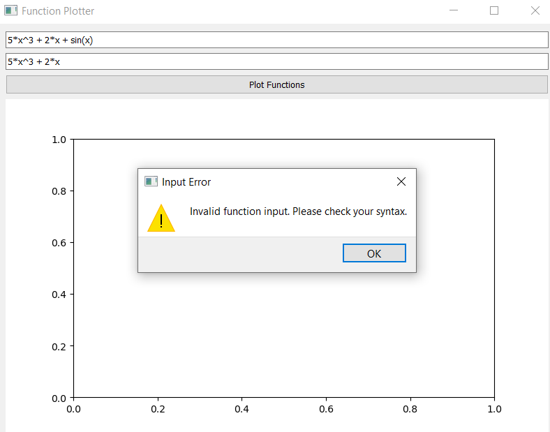

# Function Plotter

A Python GUI program to plot two functions of x and find their intersection point.

## Features
- Supports operators: `+`, `-`, `/`, `*`, `^`, `log10()`, `sqrt()`.
- Input validation for user input.
- Embedded Matplotlib plot in PySide2 GUI.
- Automated tests using pytest and pytest-qt.

## Screenshots



## Running the Program
1. Install dependencies:
   ```bash
   pip install PySide2 matplotlib pytest pytest-qt
2.Run the program and tests:  
   ```bash
   python main.py
   pytest tests/
